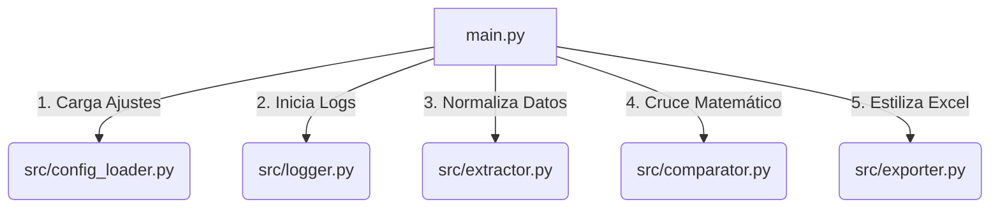

# Sistema Empresarial de Conciliación de Novedades de Nómina (Python & Pandas)

Esta herramienta automatiza, audita y valida la consistencia entre dos fuentes de datos de nómina esenciales: el **Reporte Operativo Manual (Excel)** y el **Plano Final de Nómina (CSV)**. Detecta automáticamente celdas duplicadas, diferencias en horas trabajadas, novedades faltantes en el plano de nómina y registros sobrantes.

---

## 1. Arquitectura del Sistema

El software está diseñado bajo principios **SOLID** de ingeniería de software, separando estrictamente la lectura, el procesamiento lógico, las reglas matemáticas de conciliación y la generación estética del reporte.

### Estructura de Carpetas Implementada
```text
script validacion/
├── config/
│   └── settings.json               # Configuración centralizada de mapeos y archivos
├── logs/
│   └── conciliacion_nomina.log     # Historial rotativo detallado de auditoría
├── src/
│   ├── __init__.py
│   ├── config_loader.py            # Cargador y validador de configuración JSON
│   ├── logger.py                   # Inicializador de logger de consola y archivo
│   ├── extractor.py                # Motor de limpieza y normalización de formatos
│   ├── comparator.py               # Lógica del motor de comparación matemática
│   └── exporter.py                 # Generador del reporte de Excel premium (openpyxl)
├── main.py                         # Orquestador del flujo y entrypoint de CLI
└── README.md                       # Documentación técnica e integración web (FastAPI/Laravel)
```

---

## 2. Flujo de Procesamiento y Funcionalidades Clave



1. **Detección Automática de Hojas y Cabeceras**: El extractor analiza dinámicamente las primeras filas de cada hoja del Excel. Al encontrar una columna con términos de identificación (`IDENTIFICACI`, `CEDULA`) combinada con novedades (`HORAS EXTRAS`), establece esa hoja (`TH`) y su fila de cabecera de forma automática. Esto mitiga el riesgo de filas vacías accidentales en la parte superior.
2. **Construcción de Base de Datos Maestra**: Se realiza un barrido por todas las hojas (incluyendo `Hoja1`) buscando columnas de identificación y nombres de empleados. Con esto se construye un mapa en memoria `ID -> Nombre`, permitiendo enriquecer con el nombre completo a aquellos registros que "sobran en el plano CSV" y que no figuran en la hoja operativa `TH`.
3. **Tratamiento y Normalización de Formatos**:
   - **Identificaciones**: Limpia espacios en blanco intermedios y remueve decimales de floats generados por Excel (ej: `1000920410.0` se normaliza a `1000920410`).
   - **Fechas**: Tolera celdas nativas de tipo `datetime` de openpyxl y strings en múltiples formatos (`DD/MM/YYYY`, `YYYY-MM-DD`). Las unifica a `DD/MM/YYYY`.
   - **Valores**: Convierte decimales representados con coma a punto (`0,50` -> `0.5`).
4. **Tratamiento de Duplicados**: Para auditar la calidad de los archivos de entrada, el comparator aísla las celdas redundantes (mismo empleado, tipo de novedad y día) en una pestaña `DUPLICADOS` de control de auditoría. Luego, realiza una sumatoria agrupada matemática de dichas horas antes del cruce, evitando falsos positivos de diferencia.
5. **Cruce Outer-Join**: Realiza un cruce total por `[IDENTIFICACION, CODIGO_NOVEDAD, FECHA]` y clasifica el estado de cada registro con una tolerancia decimal configurable (`0.01` horas por defecto).

---

## 3. Integración en Arquitecturas Web (FastAPI / Laravel)

La estructura modular de esta herramienta facilita su integración futura en arquitecturas de backend empresariales.

### A. Integración con FastAPI (Python Microservice)
Se puede exponer este script como un endpoint REST en FastAPI que reciba los dos archivos, ejecute la lógica y retorne el Excel final generado:

```python
import shutil
from fastapi import FastAPI, UploadFile, File, HTTPException
from fastapi.responses import FileResponse
from src.config_loader import ConfigLoader
from src.extractor import PayrollExtractor
from src.comparator import PayrollComparator
from src.exporter import ExcelReportExporter

app = FastAPI(title="Payroll Reconciliation API")

@app.post("/api/reconciliar-nomina")
async def reconciliar_nomina(
    file_csv: UploadFile = File(...), 
    file_excel: UploadFile = File(...)
):
    # 1. Guardar archivos cargados temporalmente
    temp_csv = f"temp_{file_csv.filename}"
    temp_excel = f"temp_{file_excel.filename}"
    output_xlsx = "diferencias_nomina_temp.xlsx"
    
    try:
        with open(temp_csv, "wb") as buffer:
            shutil.copyfileobj(file_csv.file, buffer)
        with open(temp_excel, "wb") as buffer:
            shutil.copyfileobj(file_excel.file, buffer)
            
        # 2. Cargar configuraciones
        config = ConfigLoader()
        
        # 3. Procesar
        extractor = PayrollExtractor(temp_csv, temp_excel, config.novelty_mapping)
        extractor.build_employee_database()
        df_csv = extractor.load_csv()
        df_excel = extractor.load_excel()
        
        comparator = PayrollComparator(df_csv, df_excel, config.novelty_mapping, extractor.employee_db)
        results = comparator.run_comparison()
        
        exporter = ExcelReportExporter(output_xlsx)
        exporter.generate_report(results)
        
        # 4. Retornar el archivo descargable
        return FileResponse(
            path=output_xlsx, 
            media_type="application/vnd.openxmlformats-officedocument.spreadsheetml.sheet", 
            filename="diferencias_nomina_mayo_2026.xlsx"
        )
    except Exception as e:
        raise HTTPException(status_code=500, detail=str(e))
    finally:
        # Limpieza de archivos temporales
        for f in [temp_csv, temp_excel]:
            if os.path.exists(f):
                os.remove(f)
```

### B. Integración con Laravel (PHP)
En un backend de Laravel, hay dos aproximaciones comunes para usar esta herramienta:

#### Opción 1: Ejecución por comando nativo (Laravel Process)
Si el servidor Laravel comparte la misma infraestructura y tiene Python instalado, Laravel puede llamar directamente al script usando el facade `Process`:

```php
use Illuminate\Support\Facades\Process;
use Illuminate\Support\Facades\Storage;

public function reconciliar(Request $request)
{
    // 1. Guardar archivos subidos en storage local
    $pathCsv = $request->file('plano_csv')->storeAs('payroll', 'plano_nomina.csv');
    $pathExcel = $request->file('reporte_excel')->storeAs('payroll', 'reporte_nomina.xlsx');

    // Rutas absolutas
    $absCsv = Storage::path($pathCsv);
    $absExcel = Storage::path($pathExcel);
    $absOutput = Storage::path('payroll/diferencias_nomina.xlsx');

    // 2. Modificar dinámicamente el config/settings.json antes de ejecutar (opcional)
    // O simplemente llamar a main.py si los archivos tienen nombres fijos configurados
    
    // 3. Ejecutar el script Python
    $result = Process::run("python main.py");

    if ($result->successful()) {
        return response()->download($absOutput);
    }

    return response()->json([
        'error' => 'Fallo la ejecución del conciliador',
        'output' => $result->errorOutput()
    ], 500);
}
```

#### Opción 2: Laravel como cliente API (Guzzle/Http)
Si el servicio de Python corre en un microservicio de FastAPI independiente (ej. en Docker), Laravel actúa como cliente:

```php
use Illuminate\Support\Facades\Http;

public function reconciliarViaAPI(Request $request)
{
    $response = Http::attach('file_csv', file_get_contents($request->file('plano_csv')), 'plano.csv')
        ->attach('file_excel', file_get_contents($request->file('reporte_excel')), 'reporte.xlsx')
        ->post('http://python-service/api/reconciliar-nomina');

    if ($response->successful()) {
        return response($response->body(), 200, [
            'Content-Type' => 'application/vnd.openxmlformats-officedocument.spreadsheetml.sheet',
            'Content-Disposition' => 'attachment; filename="diferencias_nomina.xlsx"',
        ]);
    }
}
```

---

## 4. Instrucciones de Ejecución y Buenas Prácticas

### Requisitos Previos
* **Python 3.10+** (probado y certificado en Python 3.14)
* Paquetes de dependencias instalados:
  ```bash
  pip install pandas openpyxl
  ```

### Instrucciones de Uso
1. Ubique los archivos `plano_nomina(2026-05) (1).csv` y `FO-GH-005 REPORTE DE NOVEDADES NÓMINA mayo 2026.xlsx` en la carpeta raíz del script.
2. Si los nombres de los archivos difieren en el futuro, abra `config/settings.json` y modifique los valores correspondientes.
3. Ejecute el proceso de conciliación desde su terminal:
   ```bash
   python main.py
   ```
4. El programa mostrará el **Resumen Ejecutivo de Conciliación** directamente en consola y creará el archivo premium `diferencias_nomina_mayo_2026.xlsx`.
5. Si ocurre algún error en las fechas o identificaciones de los empleados, el sistema lo manejará de forma controlada y escribirá un warning en `logs/conciliacion_nomina.log`.

---

## 5. Diseño Estético y Semántica del Reporte de Salida

El archivo Excel generado `diferencias_nomina_mayo_2026.xlsx` cuenta con un formato premium:

* **Azul Marino Profundo (`#1B365D`)**: Color institucional aplicado a todas las cabeceras de tabla, con texto en blanco negrita.
* **Resumen (Dashboard)**: Contiene tarjetas integradas con fondos diferenciados (gris, verde y rojo según el estado) que resumen horas y totales. Muestra una tabla analítica detallada con doble subrayado de contabilidad financiera para totales.
* **Colores de Pestañas**:
  - `RESUMEN`: Azul Marino Profundo (Control y Dashboard)
  - `COINCIDENCIAS`: Verde Claro (Normalidad operativa)
  - `DIFERENCIAS`: Naranja Claro (Diferencias matemáticas de horas trabajadas)
  - `FALTANTES_EN_PLANO`: Amarillo Claro (Riesgo alto: horas operativas no pagadas)
  - `SOBRANTES_EN_PLANO`: Rojo/Rosa Claro (Riesgo alto: horas pagadas no justificadas operativamente)
  - `DUPLICADOS`: Púrpura (Calidad de digitación de datos)
* **Auto-ajuste (Auto-fit)**: Todas las columnas se adaptan automáticamente a su contenido evitando truncados de celdas (`###`).
* **Líneas de cuadrícula (Grid Lines)**: Siempre visibles en todas las pestañas.
